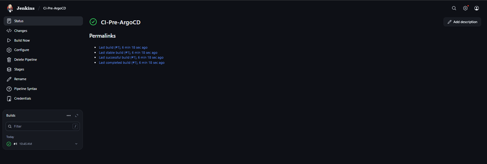
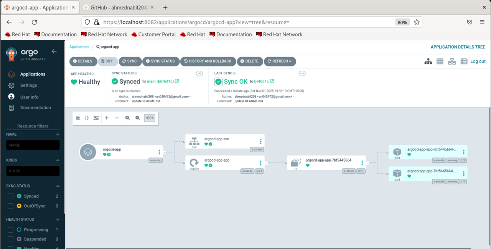
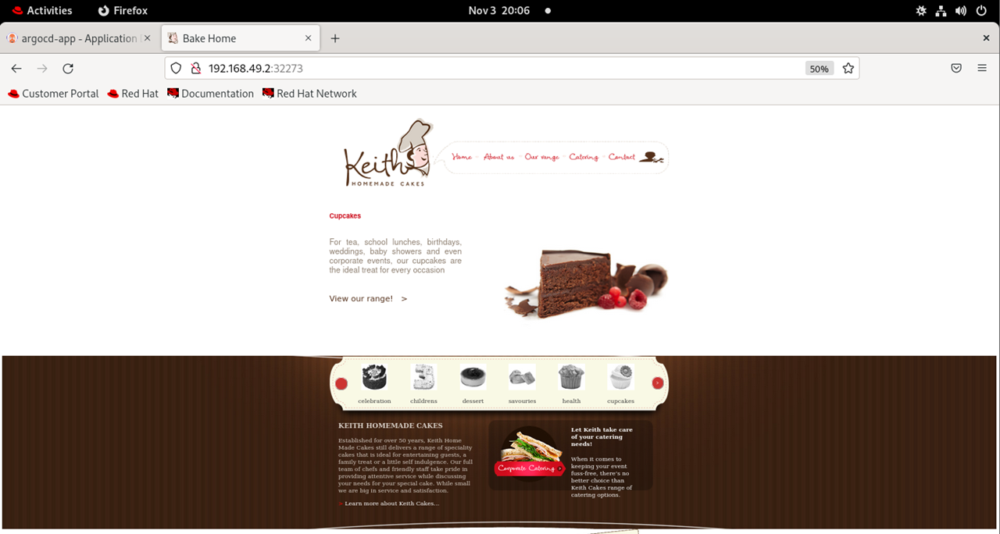

#  CI/CD with Jenkins and Argo CD

This project demonstrates a **complete CI/CD pipeline** using **Jenkins** for Continuous Integration (CI) and **Argo CD** for Continuous Deployment (CD) — all running on a local **Minikube** Kubernetes cluster.

---

## ⚙️ CI: Build and Push Docker Image using Jenkins

1. **Jenkins Pipeline (Jenkinsfile)**  
   - Builds the application Docker image from the source repository [`bakehouse`](https://github.com/SamarGooda/bakehouse-ITI)  
   - Pushes the image to **Docker Hub**.  

2. **Steps Overview**

These steps are defined in the [`jenkinsfile`](https://github.com/ahmednabil208/argocd-jenkins-demo/blob/main/jenkinsfile)   



##  CD: Deploy Argo CD inside Minikube

1. Start Minikube Cluster

```bash
minikube start --driver=docker --memory=2200mb --cpus=2
```

2. Install Argo CD
```bash
kubectl create namespace argocd
wget https://raw.githubusercontent.com/argoproj/argo-cd/stable/manifests/install.yaml
kubectl apply -n argocd -f install.yaml
```

##  Access Argo CD UI using NGINX Ingress

1. Enable the Ingress Controller

```bash
minikube addons enable ingress
```

2. Create an Ingress for Argo CD

2.1 The file are defined in the [`argocd-ingress`](https://github.com/ahmednabil208/argocd-jenkins-demo/blob/main/argocd-ingress.yaml)
Apply it
```bash
kubectl apply -n argocd -f argocd-ingress.yaml
```

2.2 Add Host Entry in /etc/hosts

<minikube-ip>  argocd.local


2.3 Access the Argo CD UI at  https://argocd.local


##  Configure Argo CD Application to Connect Repo and Cluster


The file are defined in the [`application.yaml`](https://github.com/ahmednabil208/argocd-jenkins-demo/blob/main/application.yaml).  

Apply it:
```bash
kubectl apply -f argocd-app.yaml
```


##  Access the Deployed Application

Check the service type:
```bash
kubectl get svc -n my-app
```

If NodePort:
```bash
minikube ip
```

Access via:
```bash
http://<minikube-ip>:<node-port>
```
